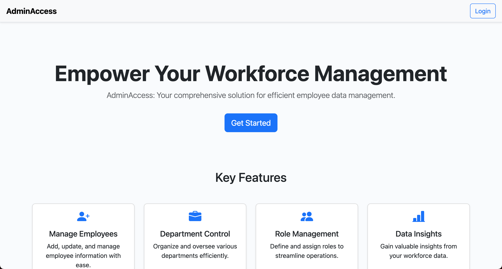

# AdminAccess
*Admin tool for managing employees, roles, and departments securely and effortlessly.*

## Built With
[](https://developer.mozilla.org/en-US/docs/Web/JavaScript)
[](https://react.dev/)
[](https://nodejs.org/en)
[](https://expressjs.com/)
[](https://www.mysql.com/)
[](https://www.npmjs.com/package/sequelize)
[](https://getbootstrap.com/)

## Table of Contents
- [Description](#description)
  - [Deployed App](#deployed-app)
- [Screenshots](#screenshots)
- [Installation](#installation)
  - [Usage](#usage)
- [Developers](#developers)
  - [Questions](#questions)
- [License](#license)

## Description
AdminAccess is a comprehensive employee data management solution designed for administrators, built with the MERN stack (MySQL, Express, React, Node). It ensures secure authentication and intuitive interface interactions. Administrators can securely log in and access options to view, add, update, and delete departments, roles, employees, and managers. They can add new entries, update roles, and delete data with confirmation dialogs to prevent accidental deletion. The application offers seamless navigation and a user-friendly interface, enhancing productivity and data management efficiency. Overall, AdminAccess provides a robust solution for organizations to manage their employee data effectively, focusing on security, efficiency, and user experience.

### Deployed App
AdminAccess is deployed on Heroku. You can access the live application [here](https://adminaccess-f697b23e85fa.herokuapp.com/).

## Screenshots



## Installation
To get started with AdminAccess, follow these steps:

1. Clone the repository to your local machine.
    ```bash
    git clone https://github.com/kyoriku/AdminAccess.git
    ```

2. Navigate to the project directory.
    ```bash
    cd AdminAccess
    ```

3. Install the required dependencies for both the client (front-end) and server (back-end) sides.
    ```bash
    npm install
    ```

4. Create a `.env` file in the server directory and fill in your database credentials.
    ```bash
    DB_NAME='your_database_name'
    DB_USER='your_MySQL_username'
    DB_PASSWORD='your_MySQL_password'
    SESSION_SECRET='your_session_secret'
    ADMIN_USERNAME='your_admin_username'
    ADMIN_EMAIL='your_admin_email_address'
    ADMIN_PASSWORD='your_admin_password'
    ```

5. Set up MySQL database.
    - **Using MySQL Workbench:**
      - Open MySQL Workbench and connect to your MySQL server.
      - Create a new schema/database (if it doesn't exist already) by clicking on the "Create a new schema in the connected server" icon or through the "File" > "New Model" menu.
      - Name the schema/database with the desired name, e.g., `your_database_name`.
      - Execute the schema provided in the `db/schema.sql` file within the created schema/database to set up the necessary tables and structure.

    - **Using MySQL Command Line:**
      - Log into MySQL and create the necessary database by executing the schema provided in the `db/schema.sql` file. Replace `<username>` with your MySQL username.
      
        ```bash
        mysql -u <username> -p
        source db/schema.sql
        quit 
        ```

6. Seed the database.
    ```bash
    npm run seed
    ```

### Usage
1. Once dependencies are installed, the environment variables are created, and the database is set up: navigate to the root directory of the project and start the server.
    ```bash
    npm run develop
    ```
    This command initiates both the server and client development environments concurrently. It will launch the development server and open AdminAccess in your default web browser. If not, navigate to http://localhost:3000 in your browser.

## Developers
[](https://github.com/ozdaldogru)
[](https://github.com/kyoriku)
[](https://github.com/dannadlerp)
[](https://github.com/justinsta624)

### Questions
For any questions, feel free to email me at devkyoriku@gmail.com.

## License
[](https://opensource.org/licenses/MIT)

This project is licensed under the [MIT](https://opensource.org/licenses/MIT) license - see the LICENSE file for details.
